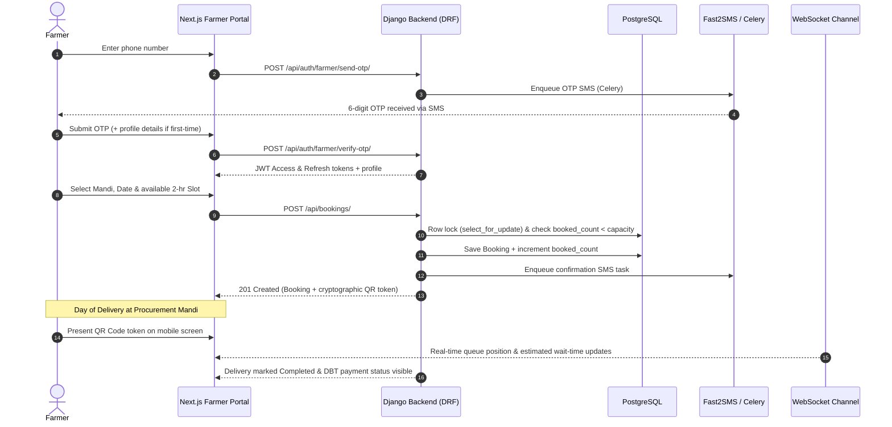
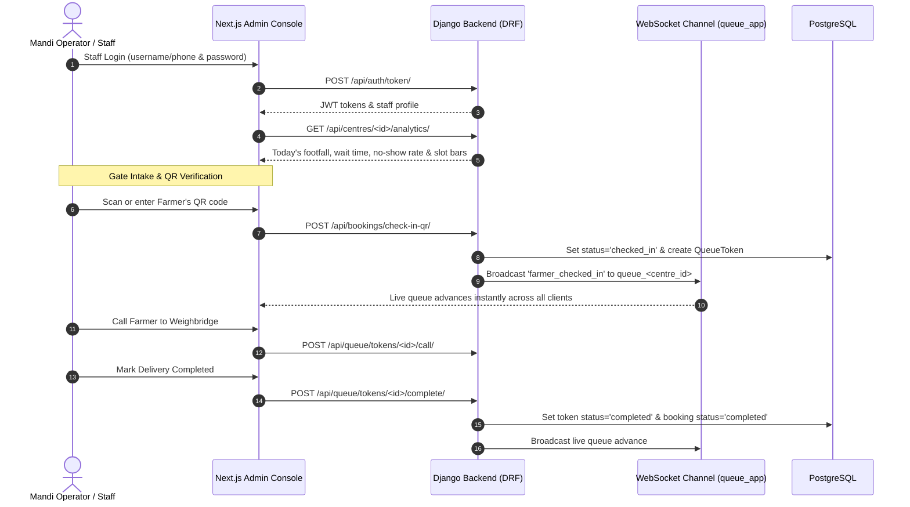
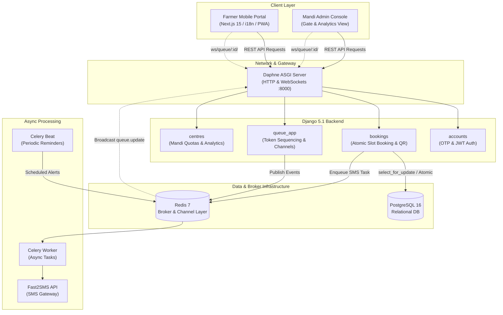

# 🌾 KisanSlot: Farmer Procurement Queue & Slot Scheduling Platform

> **Digital queue and slot management system for agricultural procurement centres to eliminate physical wait times and optimize MSP grain intake (Smart India Hackathon 2026 • PS 26032).**

[](LICENSE)
[](https://www.python.org/)
[](https://www.djangoproject.com/)
[](https://nextjs.org/)
[](https://www.typescriptlang.org/)
[](https://tailwindcss.com/)
[](https://www.docker.com/)

---

## 📌 Problem Statement (SIH 2026 • PS 26032)

* **Problem Statement ID**: 26032 (SIH 2026)
* **Organization**: Ministry of Consumer Affairs, Food & Public Distribution
* **Department**: Department of Food & Public Distribution
* **Category**: Software
* **Theme**: Agriculture, Foodtech & Rural Development

### The Challenge
During peak harvest and marketing seasons (Rabi & Kharif), millions of Indian farmers transport grain loads (wheat, paddy, pulses) to Minimum Support Price (MSP) procurement centres (Mandis). The absence of scheduled delivery allocations leads to:
* **Severe physical congestion**: Tractor trolleys queued outside Mandi gates for 24 to 72 continuous hours.
* **Crop distress & degradation**: Unprotected exposure to moisture, rain, and pest infestation during prolonged waiting under open skies.
* **Distress sales**: Desperate smallholders selling produce below MSP to informal intermediaries to escape unmanageable queues.
* **Administrative bottlenecks**: Overburdened weighing bridges, manual token confusion, and delayed Direct Benefit Transfer (DBT) reconciliations.

### The Expected Solution
1. **Capacity-Aware Online Slot Booking**: Allow farmers to book dedicated 2-hour intake delivery windows based on verified daily centre capacity and crop varieties.
2. **Digital Queue & Token Engine**: Replace manual slip distribution with real-time digital tokens, dynamic gate status displays, and live wait-time estimation.
3. **Automated Alerts & Multi-Channel Notifications**: Real-time SMS notifications for OTP access, booking confirmation, and turn-ready alerts.
4. **Inclusive Regional Multilingualism**: Intuitive multilingual interfaces accessible to grassroots farmers in regional vernacular languages.
5. **Transparent Intake & DBT Settlement**: Instant QR-based gate verification, transparent weighbridge call sequencing, and transparent MSP DBT payment status tracking.
6. **Mandi Administration & Analytics**: Centralized operational visibility tracking footfall, throughput, intake turnaround times, and slot utilization.

---

## ⚡ Tech Stack

* **Backend Framework**: Django 5.1 & Django REST Framework (DRF)
* **Real-Time Communication**: Django Channels (WebSockets) with Daphne ASGI server
* **Asynchronous Task Queue**: Celery & Celery Beat (Periodic jobs, automated SMS alerts)
* **Message Broker & Cache**: Redis 7 (`channels-redis`)
* **Primary Database**: PostgreSQL 16 (production container) / SQLite (development)
* **Frontend Framework**: Next.js 15 (App Router, React 19)
* **Programming Language**: TypeScript
* **Styling**: Tailwind CSS & Mandi Design Tokens
* **Internationalization (i18n)**: `next-intl` (English, Hindi, Punjabi)
* **SMS Gateway**: Fast2SMS API integration with resilient console fallback
* **Authentication**: JWT via `djangorestframework-simplejwt` + Mobile OTP
* **Testing & Quality**: Django APITestCase (12/12 unit suites passing) + Playwright End-to-End Suite (17/17 tests passing)

---

## 🚀 Working Features (Current Implementation)

All features listed below are fully implemented, verified, and active in the codebase:

1. **Farmer OTP-Based Registration & Login**
   * Passwordless mobile authentication via 6-digit OTP delivered via Fast2SMS (with automatic console logging fallback for development/demo environments).
   * Automatic profile creation and secure JWT access/refresh token pair issuance (`/api/auth/farmer/send-otp/`, `/api/auth/farmer/verify-otp/`).
2. **Slot Browsing & Booking with Capacity Enforcement**
   * Interactive calendar and procurement centre selector filtering by operational Mandis, grain types, and daily quotas.
   * Concurrency-safe atomic transaction handling (`select_for_update()`) that locks slot rows during booking to strictly prevent overbooking beyond configured capacity.
   * Clean HTTP 400 error validation responses (no 500 crashes) when capacity is exhausted.
3. **QR-Code Based Check-In at Procurement Centres**
   * Cryptographic UUID token and dynamic QR code generated automatically on booking confirmation.
   * Centre gate operators can check in farmers either by scanning the QR code or manual token input, transitioning status from `booked` to `checked_in`.
4. **Real-Time Queue Position Updates via WebSocket**
   * Bi-directional WebSocket endpoint (`ws/queue/<centre_id>/`) powered by Django Channels and Redis channel layer.
   * Instant real-time broadcast of check-in events (`farmer_checked_in`) and token status changes across farmer dashboards and Mandi waiting displays.
5. **SMS Notifications via Fast2SMS**
   * Asynchronous, non-blocking Celery tasks for transactional SMS dispatches.
   * Triggers for OTP verification, booking appointment confirmations (with Mandi address, date, time slot, and weight quota), and queue status updates.
6. **Multilingual Regional Support (English, Hindi, Punjabi)**
   * Complete vernacular coverage across English (`en`), Hindi (`hi`), and Punjabi (`pa` in Gurmukhi script).
   * Fallback typography support ensuring crisp glyph rendering on regional Android devices and mobile screens.
7. **Direct Benefit Transfer (DBT) Payment Tracking**
   * Real-time payment lifecycle tracking (`pending`, `processing`, `completed`, `failed`) linked to grain intake receipts.
   * Farmers can monitor MSP disbursement status and reference IDs directly from their portal.
8. **Admin & Centre-Operator Analytics Dashboard**
   * Mandi gate management console for operators to admit vehicles and call tokens to weighbridge counters.
   * Real-time analytical aggregations (`/api/centres/<id>/analytics/`) displaying today's footfall, average intake wait time, no-show rates, and horizontal slot capacity distribution charts.

---

## 🔄 User Workflows

### 🧑‍🌾 Farmer Workflow



1. **Registration / Login**:
   * Farmer visits the portal, selects "Farmer Login", and enters their 10-digit mobile number.
   * A 6-digit OTP is generated and dispatched via Fast2SMS (`POST /api/auth/farmer/send-otp/`), with automatic console logging in development/demo environments.
   * First-time farmers provide registration details (full name, village, district, state, preferred language [English, Hindi, or Punjabi], and primary crop type); returning farmers authenticate directly (`POST /api/auth/farmer/verify-otp/`) and receive JWT access/refresh tokens.
2. **Browse & Book a Slot**:
   * The farmer selects their target procurement centre (Mandi) and delivery date to inspect available 2-hour time windows with real-time capacity counters (`GET /api/bookings/slots/`).
   * The backend enforces atomic database locking (`select_for_update()`) inside a transaction during booking creation (`POST /api/bookings/`). If a slot is fully booked (`booked_count >= capacity`), the request is rejected with a clean `400 Bad Request` validation error prompting the farmer to pick another slot.
3. **Booking Confirmation**:
   * Upon successful booking, an asynchronous Celery task dispatches an SMS confirmation containing the Mandi name, appointment date, time window, and produce quantity quota.
   * A unique cryptographic UUID token is generated and rendered as an interactive QR code in the farmer's dashboard under upcoming bookings.
4. **Day of Delivery — Gate Check-In**:
   * On arrival at the procurement centre, the farmer presents their digital QR code (or token number) to the gate operator for verification.
5. **Live Queue Tracking**:
   * As soon as the gate operator confirms entry, the farmer's dashboard connects to the live WebSocket channel (`ws/queue/<centre_id>/`).
   * The dashboard displays their assigned token number, the number of vehicles ahead in queue, and a dynamic wait-time estimate based on the centre's average intake turnaround.
6. **Completion & Payment Status**:
   * After produce grading, weighing, and unloading, the operator marks the token completed.
   * The farmer's booking status transitions to "Completed" and their portal displays real-time Direct Benefit Transfer (DBT) MSP payment status (`pending`, `processing`, `completed`) along with transaction references.

---

### 🏢 Centre Operator / Admin Workflow



1. **Staff Login**:
   * The Mandi gate operator or system administrator logs in using their registered username/phone and password on the admin authentication page (`POST /api/auth/token/`).
2. **Dashboard Overview**:
   * Upon login, the operator selects their assigned procurement centre (Karnal, Panipat, Ambala, or Kurukshetra) to view today's active delivery appointments, live intake throughput, and total capacity ceilings.
3. **Slot & Capacity Management**:
   * Daily quotas and 2-hour intake slot windows are configured via the Django Administration Console (`/admin/bookings/slot/`) or the REST API (`POST /api/bookings/slots/`), establishing intake limits that directly constrain farmer booking availability and power analytics charts.
4. **QR Gate Check-In**:
   * When a farmer arrives at the Mandi gate, the operator scans the farmer's QR code via camera or enters the token manually (`POST /api/bookings/check-in-qr/`).
   * The backend validates the appointment, marks the booking as `checked_in`, generates an intake `QueueToken`, and broadcasts the `farmer_checked_in` event over WebSocket channel `queue_{centre_id}`.
5. **Live Queue Management**:
   * The operator monitors the live queue queue list on their terminal.
   * When a weighbridge scale becomes free, the operator calls the next farmer in sequence (`POST /api/queue/tokens/<id>/call/`).
   * Once quality inspection and weighing are finished, the operator marks the delivery as completed (`POST /api/queue/tokens/<id>/complete/`), advancing the queue and broadcasting the update to all waiting farmers.
6. **Payment & Operational Analytics**:
   * The operator reviews real-time Mandi performance metrics (`GET /api/centres/<id>/analytics/`):
     * **Today's Footfall**: Distinct counts for checked-in, in-queue, and completed deliveries.
     * **Average Intake Wait Time**: Actual turnaround time against the $\le 30$-minute target.
     * **No-Show Rate**: Percentage of unattended reservations for capacity planning.
     * **Time Slot Capacity Distribution**: Horizontal utilization bars per 2-hour window.
   * Completed deliveries can be reviewed for MSP Direct Benefit Transfer (DBT) payment reconciliation (`GET /api/bookings/payments/`).

---

## 🏗️ System Architecture



### End-to-End Operational Lifecycle:
1. **Authentication**: Farmer enters mobile number $\rightarrow$ Backend generates 6-digit OTP $\rightarrow$ Celery worker triggers SMS via Fast2SMS $\rightarrow$ Farmer enters OTP and receives JWT tokens.
2. **Scheduling**: Farmer selects Mandi and available time window $\rightarrow$ Backend locks row with `select_for_update()` $\rightarrow$ Enforces `booked_count < capacity` $\rightarrow$ Generates Booking with QR token.
3. **Arrival & Gate Check-In**: Farmer arrives at Mandi $\rightarrow$ Gate operator scans QR code via camera $\rightarrow$ Backend marks booking `checked_in`, creates `QueueToken`, and broadcasts `farmer_checked_in` over WebSocket channel `queue_{centre_id}`.
4. **Weighbridge & Payout**: Operator calls token to scale $\rightarrow$ Produce weighed and graded $\rightarrow$ Farmer departs $\rightarrow$ Payment status transitions to `processing` / `completed` via DBT.

---

## 🛠️ Setup & Running Instructions

### Option 1: Quickstart with Docker Compose (Recommended)

#### Prerequisites
* [Docker Desktop](https://www.docker.com/products/docker-desktop/) (v24+ with Compose v2)

#### 1. Clone the repository and initialize environment variables
```bash
git clone https://github.com/1Bharat007/Farmer-Procurement-System-PS-number---26032-SIH-26.git
cd Farmer-Procurement-System-PS-number---26032-SIH-26
cp .env.example .env
```

#### 2. Start all 6 containerized services
```bash
docker-compose up --build -d
```

#### 3. Seed demo data
```bash
docker exec -it sih_backend python manage.py seed_demo_data
```
*(Or use `python manage.py demo_reset` to restore a clean state anytime)*

---

### Option 2: Local Development (Without Docker)

#### Backend Setup (Python 3.11+)
```bash
cd backend
python -m venv venv

# Windows (PowerShell):
.\venv\Scripts\Activate.ps1
# Linux/macOS:
source venv/bin/activate

pip install -r requirements.txt
python manage.py migrate
python manage.py seed_demo_data
python manage.py runserver 8000
```

#### Frontend Setup (Node.js 18+)
```bash
cd frontend
npm install
npm run dev
```

---

## 🌐 Service Access Points & Demo Credentials

| Service | Local URL | Description |
| :--- | :--- | :--- |
| **Frontend Farmer Portal** | [http://localhost:3000](http://localhost:3000) | Next.js 15 Web Application |
| **Admin Analytics Console** | [http://localhost:3000/admin](http://localhost:3000/admin) | Live intake, queue & analytics monitor |
| **Backend REST API Root** | [http://localhost:8000/api/](http://localhost:8000/api/) | Django REST Framework API root |
| **System Health Check** | [http://localhost:8000/api/health/](http://localhost:8000/api/health/) | Real-time DB, Redis & Celery diagnostics |
| **Django Admin Panel** | [http://localhost:8000/admin/](http://localhost:8000/admin/) | Database model administration |
| **WebSocket Stream** | `ws://localhost:8000/ws/queue/<id>/` | Real-time queue event consumer |

### Ready-to-Use Demo Accounts:
* **System Administrator**: `admin` / `admin123` (or phone `9999999999`)
* **Karnal Mandi Operator**: `9811111111` / `operator123`
* **Ludhiana Mandi Operator**: `9822222222` / `operator123`
* **Demo Farmer (Hindi/English)**: Phone `9800000001` (Enter OTP `123456` or check console)
* **Demo Farmer (Punjabi)**: Phone `9800000002` (Enter OTP `123456` or check console)

---

## 🔌 API Documentation

| Module | Method | Endpoint | Description | Auth Required |
| :--- | :---: | :--- | :--- | :---: |
| **System** | `GET` | `/api/health/` | Active health check verifying DB, Redis & Celery | No |
| **Auth** | `POST` | `/api/auth/farmer/send-otp/` | Generates & delivers 6-digit OTP to farmer mobile | No |
| **Auth** | `POST` | `/api/auth/farmer/verify-otp/` | Verifies OTP and returns JWT `access` & `refresh` | No |
| **Auth** | `POST` | `/api/auth/token/` | Standard JWT token obtain for admin/operators | No |
| **Auth** | `POST` | `/api/auth/token/refresh/` | Refreshes expired JWT access token | No |
| **Auth** | `GET` | `/api/auth/me/` | Retrieves authenticated user profile & role | Yes (Bearer) |
| **Centres** | `GET` | `/api/centres/` | Lists procurement centres with daily quotas | No |
| **Centres** | `GET` | `/api/centres/<id>/analytics/` | Live footfall, wait time, no-show rate & slot charts | Yes (Staff) |
| **Bookings** | `GET` | `/api/bookings/slots/?centre=<id>`| Retrieves available delivery slots with capacity | No |
| **Bookings** | `POST` | `/api/bookings/` | Books a slot (atomic locking & capacity check) | Yes (Farmer) |
| **Bookings** | `POST` | `/api/bookings/<id>/cancel/` | Cancels booking & safely decrements `booked_count` | Yes (Farmer/Staff) |
| **Bookings** | `POST` | `/api/bookings/check-in-qr/` | Gate check-in via QR token; triggers WS broadcast | Yes (Staff) |
| **Queue** | `GET` | `/api/queue/tokens/?centre=<id>` | Lists active queue tokens and waiting state | Yes |
| **Queue** | `POST` | `/api/queue/tokens/<id>/call/` | Calls token to weighbridge counter | Yes (Staff) |
| **Payments**| `GET` | `/api/bookings/payments/` | Lists farmer MSP DBT disbursement records | Yes (Farmer) |
| **WebSocket**| `WS` | `/ws/queue/<centre_id>/` | Bi-directional live channel for queue updates | No |

---

## 👥 SIH 2026 Team & Contributors

Developed for **Smart India Hackathon 2026** under Problem Statement **26032**:
* **Team**: KisanSlot Platform Team
* **Submission Lead**: 1Bharat007
* **Domain**: Agritech, Queue Management & Rural Digital Infrastructure

---

## 📄 License

This project is licensed under the [MIT License](LICENSE) — see the [LICENSE](LICENSE) file for complete details.
